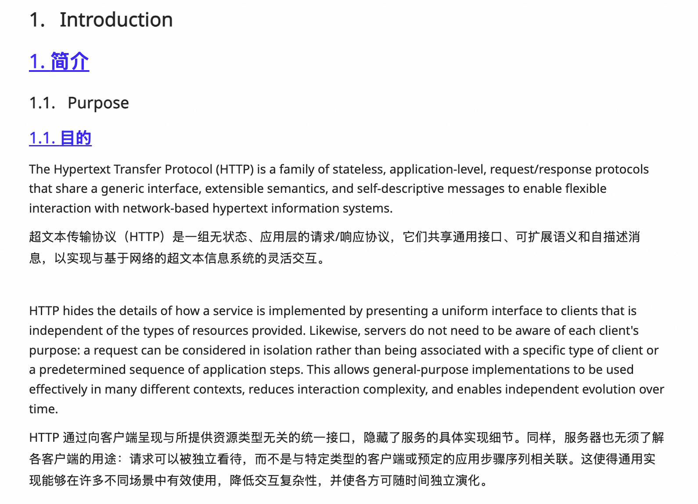

# 简译

一个轻量、开源的 Chrome / Edge 双语阅读插件。使用你自己的大语言模型翻译网页和 PDF，无广告，无需注册。

## 能做什么

- **网页双语阅读**：译文放在原文下方，方便对照，保留链接和常见文字格式。
- **PDF 对照阅读**：左侧原文、右侧译文，按页翻译。
- **自选模型**：配置模型名、Base URL 和 API Key，也可以调整翻译 Prompt 和请求参数。
- **一键切换**：通过插件菜单或网页悬浮按钮显示、隐藏译文。

## 使用效果

网页双语阅读：原文与译文逐段对应，阅读时可以随时对照。



## 安装

目前通过加载源码安装，需要先安装 Node.js 和 npm。

```sh
git clone https://github.com/lc-beep/minimal-translate.git
cd minimal-translate
npm ci
npm run build
```

1. 打开 Chrome 的 `chrome://extensions/` 或 Edge 的 `edge://extensions/`。
2. 开启「开发者模式」，点击「加载已解压的扩展程序」。
3. 选择项目中的 `extension` 文件夹。

## 配置模型

打开插件菜单中的「模型与翻译设置」，填写：

- **Base URL**：模型服务的接口地址，例如 `https://provider.example/v1`。
- **模型名**：填写服务商提供的准确名称。
- **API Key**：填写你的密钥；无鉴权的本地服务可以留空。

支持 OpenAI 兼容的 Chat Completions 接口。其他参数可先保持默认，点击「保存并测试连接」，按提示允许访问模型地址。

## 使用

**网页**：打开文章，点击插件菜单中的「翻译 / 隐藏网页译文」。向下滚动时会继续翻译；点击悬浮按钮可切换显示。如需在该网站常驻按钮，选择「在此网站显示悬浮按钮」。

**PDF**：先下载文件，再从插件菜单打开「PDF 对照阅读」，选择文件并点击「翻译本页」。翻译失败时可以重试，已完成的片段会保留。

更新源码并重新构建后，在扩展管理页点击「重新加载」，再刷新文章页即可。

## 使用须知

- API Key 保存在本机浏览器中，待翻译文本直接发送到你配置的模型服务。费用由该服务决定。
- PDF 需要包含可提取的文字，暂不支持扫描件 OCR；复杂分栏和公式请对照原文检查。
- 翻译质量和速度取决于所选模型，部分网页的特殊布局可能无法识别。

遇到问题或有建议，欢迎提交 [Issue](https://github.com/lc-beep/minimal-translate/issues)，附上网址或 PDF 页码、操作步骤和截图。请勿上传 API Key 等敏感信息。
